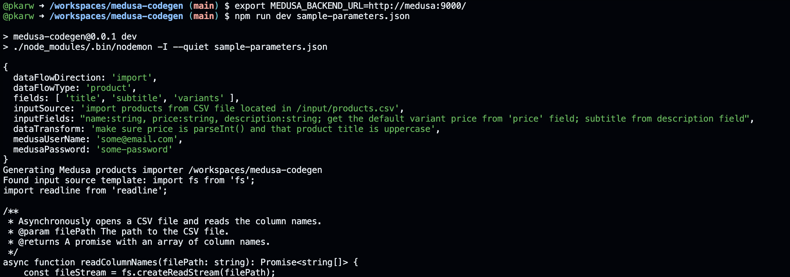

# Medusa Codegen

This is a Proof of Concept version of MedusaJS AI based code generation platform. The first use cases are build around import/export features supporting [all available Ollama open source models](https://ollama.com/library) (including LLama3, CodeLlama ...) and GPT-4o as an option. It can integrate MedusaJS with literally anything which could be accesed via TypeScript code. No coding skill required.

LLM aspect is pretty import in this project because all the code - for now Import and Export Operations are **generated by AI**. You only need to prompt the description of your data input our output and we'll do the rest - generating the suitable importer or exporter code that you can run anytime.

## Project state

Currently we focused on import/export operations and actually this Proof of Concept version supports only products and CSV and Postgres as import methods.
The application is a very simple RAG using the in-memory vectors to find the proper code templates, then custom user prompts and inputs - to generate the code in the end. Code is always generated into `generated` folder.

Example run using the default `sample-parameters.json`:


You can stream any sort of input parameters as STDIN (eg. streaming json file: `npm run dev sample-parameters.json`) or you might use the interactive mode `npm run dev`.

When you run this program a data importer code will be generated within the `generated` folder.

## Input parameters and extension points

Sample input parameters for `product-importer` generator:

```json
{
    "dataFlowDirection": "import",
    "dataFlowType": "product",
    "fields": [ "title", "subtitle", "variants" ],
    "inputSource": "import products from CSV file located in /input/products.csv",
    "inputFields": "name:string, price:string, description:string; get the default variant price from 'price' field; subtitle from description field",
    "dataTransform": "make sure price is parseInt() and that product title is uppercase",
    "medusaUserName": "some@email.com",
    "medusaPassword": "some-password"
}
```

By using this set of paramters, `medusa-codegen` will generate the full CSV importer using the [CSV importer template](src/import-sources/import-csv.ts), using the [product fields sepc for Medusa](src/platforms/medusa/specs/products/medusa-product-fields.json) and the general [product-import template](src/platforms//medusa//templates/importer.ts).

The custom generated importer program will look something like this:

```typescript
function parseSingleRecord(line: string, columnNames: string[]): Record<string, any> {
    const values = line.split(',');
    const record: Record<string, any> = {};
    columnNames.forEach((columnName, index) => {
        record[columnName] = values[index];
    });
    return record;
}

const importSingleProduct = async (product: any, apiToken: string) => {
  console.log("Product in Medusa format: ", product);
  return medusa.admin.products.create(product, { Authorization: 'Bearer ' + apiToken })
  .then(({ product }) => {
    console.log("Product successfully added with ID: " + product.id);
  });
}

const transformSourceDataToMedusa = (sourceRecord: any): any => {
  console.log("Product in source format: ", sourceRecord);
  const price = parseInt(sourceRecord.price);
  const title = sourceRecord.name.toUpperCase();
  const subtitle = sourceRecord.description;

  return {
    title,
    subtitle,
    variants: [
      {
        title: 'Default Variant',
        prices: [
          { amount: price, currency_code: 'USD' }
        ]
      }
    ]
  };
}
```

The program can be tested by running `npm run test-product`

As you see it's pretty straightforward to extend the app by defining new [import-sources](src/import-sources/) and adding new [importer generators](src/platforms//medusa//import-generators/).

The general prompt is generated in the [product-import.ts](src/platforms/medusa/import-generators/product-import.ts) generator and looks something like this:

```typescript
      const fullPrompt =         
        `\
        Generate the code for TypeScript program which Imports the data: ${inputSourcePrompt}\

        by merging this importer code:

        >>> \
        ${importerSourceTemplate} \
        <<< \

        with this template:

        >>> \
        ${importerTemplate} \
        <<< \

       In "runImport" tunction: 
       1. Open data source with "processInput" function. 
       2. Modify the "processSingleRecord" function:
       2.1 Parse the source file and extract the relevant fields using "parseSingleRecord" function. \
       2.2 Use function "importSingleProduct" to process every record read by "parseSingleRecord" function. \
       2.3 Within "transformSopurceDataToMedusa" generate code to apply this data transform logic: ${context.dataTransform} \
       2.4 Then, modify function "transformSourceDataToMedusa" to return data in MedusaJS format:
       from input fields: ${context.inputFields}\n
       map to output fields: \n
       2.5 Make sure there's at least one variant specified in "variants" and has set price. Name the variant like the product title.
       ${JSON.stringify(fieldsToImport)} \
       Only these outpupt fields should be returned. \
       Set the constant "MEDUSA_BACKEND_URL" to ${context.medusaUrl} \
       Set the constant "MEUDUSA_USERNAME" to ${context.medusaUserName} \
       Set the constant "MEUDUSA_PASSWORD" to: ${context.medusaPassword} \
       Use only standard Node modules like fs, http and others. Do not use any undefined functions.
       \n
       Return the full source code of entire program including all imports, constains and functions. \
       `;
```

## Ideas and TODO

There's quite a lot ideas for further development:
- add more `input-sources` to support all sort of PIM's, databases etc
- add `customers` and `orders` importers
- add some exporters as well! :)
- add Medusa modules generator to speed up the Medusa customizations
- add Medusa UI templates generators

## Installation

To install the required dependencies, run the following command:

```
docker-compose up
```

The default `docker-compose.yml` file is setting up MedusaJS, Postgres and Node (app) containers

There's additional docker file `docker-compose-ollama.yml` which is setting up the `ollama` container as well so you don't need to query OpenAI GPT.

It may take a while because this command is downloading the latest LLama3 distribution (4.7GB). Then it's also installing MedusaJS, Postgres DB and so on.

You can skip the docker-compose step and run the application locally as well - especially with OpenAI as LLM (bc. in this case you don't have to have ollama up and running).

## Usage

Before starting the app make sure the `.env` file is set up (for docker) scenario or export the required ENV variables:

```
# the API key is required even when running ollama mode - because in any case we're using OpenAI embeddings model for vectorization.

export OPENAI_API_KEY=

# the options are: openai or ollama
export LLM_PROVIDER=openai

# if you run medusa locally/remotely please paste the root URL herer
export MEDUSA_BACKEND_URL=http://medusa:9000/
```

To run the application in development mode, use the following command:

```
docker-compose run app npm run dev
```

If you don't like to use docker you might run the app simply by:

```
npm run dev
```

This command uses `nodemon` and `tsx` to automatically restart the application whenever changes are made to the source files.
 
To run the example CSV importer you can take the stored `sample-parameters.json` as an input and run the app without the interactive mode by executing:

```
docker-compose run app npm run dev sample-parameters.json
```

or locally:

```
npm run dev sample-parameters.json
```

When the product importer is properly generated you can run:

```
npm run test-product
```

.. to execute the generated importer.


Note: When using OLLAMA as LLM provider you can change the LLM model by switching the `OLLAMA_MODEL` env variable to any of [those supported](https://ollama.com/library).

## Medusa JS instance

There's also a Medusa test instance defined in the `docker-compose` file - which is by default run on `http://localhost:9000/app/login`

To add a default admin user please run:

```
docker-compose exec medusa npx medusa user -e some@email.com -p some-password 
```

## License

This project is licensed under the MIT License. See the [LICENSE](./LICENSE) file for details.
```
